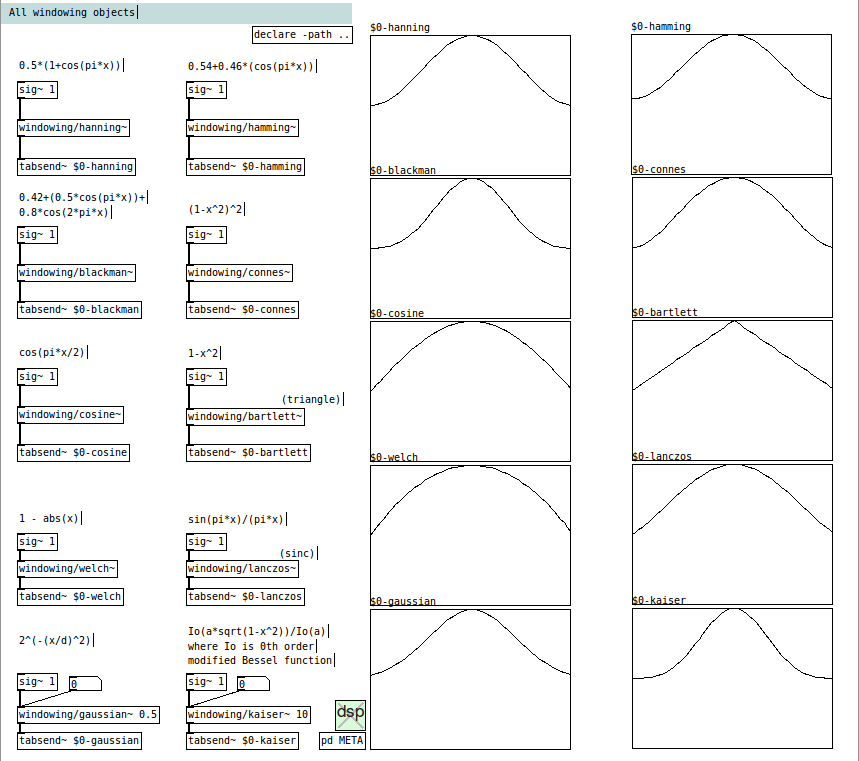

windowing - Windowing is an implementation of several window functions by 
Joseph A. Sarlo.

This git-fork of the Pure-data library windowing is cloned from 
https://git.puredata.info/cgit/svn2git/libraries/fwindowing.git, which is 
the svn-to-git from 
https://sourceforge.net/p/pure-data/svn/HEAD/tree/trunk/externals/windowing/.

See the original README.txt for more information. An extensive 
description of window functions can be found at 
https://en.wikipedia.org/wiki/Window_function.

For bugs found in this version, please report them to me. Joseph is not 
responsible for bugs introduced by me.

Fred Jan Kraan fjkraan@xs4all.nl 2019-12-22
